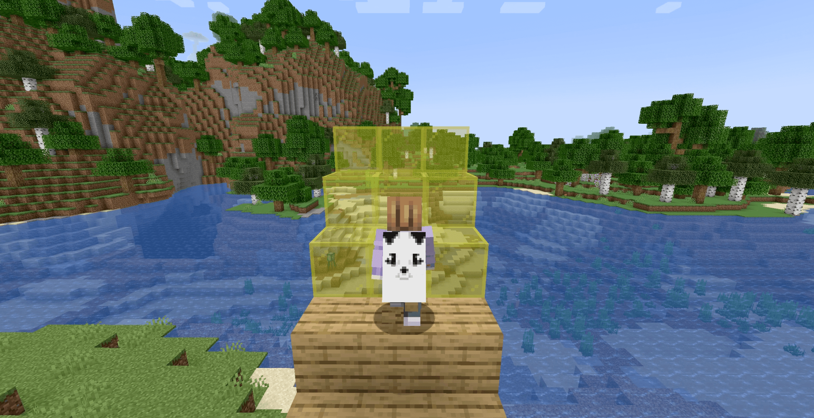

# Minecraft Fortnite
A Minecraft Spigot plugin that tries to emulate Fortnite building behaviour.

## Features
The plugin supports three different building modes:
- Wall
- Stair
- Floor

These building modes are basically all a 3x3 block wall,
just using a different orientation :).

## Demo
[Click here](https://www.youtube.com/watch?v=svIZYUJCbvo) for a short demo showing the plugin.
